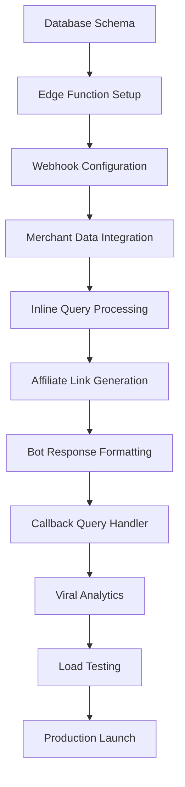

# HeyMax_shop_bot Agile Implementation Workflow

## Executive Summary

**Project**: Viral Telegram Bot for Social Commerce **Duration**: 2-3 weeks (3
sprints)\
**Architecture**: Supabase Edge Functions + PostgreSQL (Free Tier) **Goal**:
Zero-cost MVP validation with <1 second response time and viral growth mechanics

---

## Sprint Structure Overview

| Sprint       | Duration        | Focus                       | Key Deliverables                                      |
| ------------ | --------------- | --------------------------- | ----------------------------------------------------- |
| **Sprint 1** | Week 1 (5 days) | Foundation & Infrastructure | Database schema, Supabase setup, basic edge function  |
| **Sprint 2** | Week 2 (5 days) | Core Bot Functionality      | Inline queries, affiliate links, Telegram integration |
| **Sprint 3** | Week 3 (5 days) | Viral Mechanics & Launch    | Callback handlers, analytics, testing, deployment     |

---

## Sprint 1: Foundation & Infrastructure (Week 1)

### Sprint Goal

Establish the technical foundation with Supabase Edge Functions, database
schema, and basic Telegram webhook integration.

### User Stories

#### Epic 1: Infrastructure Setup

**As a developer, I need a working Supabase environment so that the bot can
process requests and store data.**

##### US1.1: Database Schema Implementation

```sql
-- Priority: Critical
-- Estimate: 1 day
-- Acceptance Criteria:
- PostgreSQL tables created: users, merchants, link_generations
- Primary keys and foreign key relationships established  
- Indexes optimized for query performance
- Free tier storage constraints respected (<50MB)
```

**Implementation Tasks:**

- [ ] Create Supabase project and configure PostgreSQL database
- [ ] Implement users table with Telegram user_id as primary key
- [ ] Implement merchants table with slug-based primary key
- [ ] Implement link_generations table with UUID and foreign key relationships
- [ ] Add database indexes for performance optimization
- [ ] Validate schema against free tier 500MB limit

**Dependencies**: None (can start immediately) **Definition of Done**: Database
accessible via Supabase dashboard, all tables queryable, sample data inserted
successfully

---

##### US1.2: Basic Edge Function Architecture

```typescript
// Priority: Critical  
// Estimate: 2 days
// Acceptance Criteria:
- Supabase Edge Function deployed and accessible via HTTPS
- Basic TypeScript/Deno structure established
- Environment variable configuration working
- Basic error handling and logging implemented
```

**Implementation Tasks:**

- [ ] Create Supabase Edge Function with TypeScript/Deno
- [ ] Implement basic request/response structure
- [ ] Configure environment variables for bot tokens and database access
- [ ] Add structured logging with different levels (info, warn, error)
- [ ] Implement basic error handling for function invocation
- [ ] Test function deployment and rollback procedures

**Dependencies**: Database schema (US1.1) **Definition of Done**: Edge function
responds to HTTP requests, logs visible in Supabase dashboard, environment
variables accessible

---

##### US1.3: Telegram Webhook Configuration

```typescript
// Priority: Critical
// Estimate: 1 day
// Acceptance Criteria:
- Telegram webhook endpoint configured and verified
- Bot token validation working
- Basic message parsing implemented
- Webhook security validation (optional for MVP)
```

**Implementation Tasks:**

- [ ] Register bot with Telegram BotFather and obtain token
- [ ] Configure webhook URL to point to Supabase Edge Function
- [ ] Implement webhook signature validation (Telegram security)
- [ ] Add basic message parsing for text and inline queries
- [ ] Test webhook delivery with simple echo responses
- [ ] Document webhook endpoint and testing procedures

**Dependencies**: Edge Function (US1.2) **Definition of Done**: Telegram
messages reach edge function, basic parsing works, logs show message data

---

##### US1.4: Static Merchant Data Integration

```json
// Priority: High
// Estimate: 1 day  
// Acceptance Criteria:
- HeyMax merchant dataset integrated as static JSON
- Database populated with merchant information
- Merchant lookup by slug working efficiently
- Data validation against HeyMax schema
```

**Implementation Tasks:**

- [ ] Extract key merchant data from HeyMax dataset (merchant_name,
      merchant_slug, tracking_link, base_mpd)
- [ ] Create merchant seed data script for database population
- [ ] Implement merchant lookup function with error handling
- [ ] Validate data structure matches expected schema
- [ ] Optimize merchant queries for <100ms response time
- [ ] Add merchant data validation and error responses

**Dependencies**: Database schema (US1.1) **Definition of Done**: Merchants
queryable by slug, data validation working, lookup performance <100ms

---

### Sprint 1 Quality Gates

**Technical Validation:**

- [ ] All Supabase Edge Function calls complete within 2-second timeout
- [ ] Database queries execute within 100ms
- [ ] Webhook delivery success rate >95%
- [ ] Error logs contain actionable debugging information

**Security Validation:**

- [ ] Bot token stored securely in environment variables
- [ ] Database access properly scoped and authenticated
- [ ] Webhook signature validation implemented
- [ ] No sensitive data logged in error messages

**Performance Baseline:**

- [ ] Function cold start time <1 second
- [ ] Database connection establishment <200ms
- [ ] Memory usage <64MB per invocation
- [ ] Free tier usage tracking implemented

---

## Sprint 2: Core Bot Functionality (Week 2)

### Sprint Goal

Implement core inline bot functionality with affiliate link generation and user
tracking.

### User Stories

#### Epic 2: Inline Bot Core Features

**As a Telegram user, I can type @HeyMax_shop_bot [merchant] to instantly
receive my personalized affiliate link.**

##### US2.1: Inline Query Processing

```typescript
// Priority: Critical
// Estimate: 2 days
// Acceptance Criteria:  
- Inline queries parsed correctly (@HeyMax_shop_bot [merchant])
- Merchant name matching with fuzzy search capability
- User identification and tracking working
- Response time <1 second for inline queries
```

**Implementation Tasks:**

- [ ] Implement inline query handler in edge function
- [ ] Add merchant name parsing and validation
- [ ] Implement fuzzy string matching for merchant names
- [ ] Add user identification via Telegram user_id
- [ ] Create user record on first interaction
- [ ] Add query validation and error handling
- [ ] Test with various merchant name formats

**Dependencies**: Merchant data (US1.4), webhook setup (US1.3) **Definition of
Done**: Inline queries parsed successfully, merchant matches found, user
tracking active

---

##### US2.2: Affiliate Link Generation

```typescript
// Priority: Critical
// Estimate: 1.5 days
// Acceptance Criteria:
- Personalized tracking links generated with user_id substitution
- Link validation and error handling implemented  
- Database tracking of link generation events
- Support for HeyMax tracking parameter format
```

**Implementation Tasks:**

- [ ] Implement affiliate link generation with {{USER_ID}} substitution
- [ ] Add link validation to ensure proper URL format
- [ ] Create link_generations database record for each generation
- [ ] Implement error handling for invalid merchants
- [ ] Add link expiration and refresh logic (if needed)
- [ ] Test link generation with various merchant types

**Dependencies**: Inline query processing (US2.1)\
**Definition of Done**: Links generated successfully, database records created,
links contain proper tracking parameters

---

##### US2.3: Bot Response Formatting

```typescript
// Priority: High
// Estimate: 1 day
// Acceptance Criteria:
- Formatted bot responses with merchant information
- Inline keyboard buttons properly configured
- Response includes earning potential and merchant details
- Message formatting optimized for group chat visibility
```

**Implementation Tasks:**

- [ ] Design bot response template with merchant information
- [ ] Implement inline keyboard with two buttons (shop link + viral button)
- [ ] Add Max Miles earning information display
- [ ] Create response formatting for different merchant types
- [ ] Test message rendering in different Telegram clients
- [ ] Optimize message length for group chat readability

**Dependencies**: Affiliate link generation (US2.2) **Definition of Done**: Bot
responses properly formatted, buttons functional, merchant information displayed
correctly

---

##### US2.4: User Analytics Foundation

```sql
-- Priority: Medium
-- Estimate: 1 day  
-- Acceptance Criteria:
- Basic user interaction tracking implemented
- Link generation events logged with metadata
- Query performance optimized for analytics
- Privacy-compliant data collection
```

**Implementation Tasks:**

- [ ] Extend link_generations table with analytics metadata (chat_id, timestamp)
- [ ] Implement user activity tracking (first_seen, link_count updates)
- [ ] Add basic query patterns for usage analytics
- [ ] Create data aggregation functions for reporting
- [ ] Implement privacy controls for user data
- [ ] Test analytics data collection and querying

**Dependencies**: Database schema (US1.1), link generation (US2.2) **Definition
of Done**: Analytics data collected, queries functional, privacy compliant

---

##### US2.5: Error Handling & Edge Cases

```typescript
// Priority: High
// Estimate: 1 day
// Acceptance Criteria:
- Graceful handling of invalid merchant names
- User-friendly error messages for edge cases
- Rate limiting protection for spam prevention  
- Timeout handling for database operations
```

**Implementation Tasks:**

- [ ] Implement comprehensive error handling for all user inputs
- [ ] Add user-friendly error messages for common issues
- [ ] Create rate limiting logic to prevent spam (10 requests/minute per user)
- [ ] Add timeout handling for database and external operations
- [ ] Implement fallback responses for service degradation
- [ ] Test error scenarios and edge cases thoroughly

**Dependencies**: All other US2.x stories **Definition of Done**: Error handling
robust, user experience smooth, rate limiting effective

---

### Sprint 2 Quality Gates

**Functional Validation:**

- [ ] Inline queries respond within 1 second 95% of the time
- [ ] Affiliate links generated successfully for all valid merchants
- [ ] User tracking accurate and consistent
- [ ] Error handling provides useful feedback without breaking bot

**Integration Testing:**

- [ ] Bot works in private messages and group chats
- [ ] Multiple concurrent users handled properly
- [ ] Database operations complete successfully under load
- [ ] Webhook processing handles Telegram API variations

**Performance Metrics:**

- [ ] Average response time <800ms for inline queries
- [ ] Database operation success rate >99%
- [ ] Memory usage remains <32MB per invocation
- [ ] Free tier function call usage <80% of monthly limit

---

## Sprint 3: Viral Mechanics & Launch (Week 3)

### Sprint Goal

Implement viral growth mechanics with "Get MY Unique Link" functionality and
prepare for production launch.

### User Stories

#### Epic 3: Viral Growth Engine

**As a group chat member, I can tap "Get MY Unique Link" to generate my own
affiliate link and create viral loops.**

##### US3.1: Callback Query Handler

```typescript
// Priority: Critical
// Estimate: 1.5 days
// Acceptance Criteria:
- Callback queries from inline buttons processed correctly
- User identification from callback data working  
- New bot responses generated for requesting users
- Viral loop mechanics functioning as designed
```

**Implementation Tasks:**

- [ ] Implement callback query handler for inline button presses
- [ ] Parse callback data to identify merchant and requesting user
- [ ] Generate new personalized response for callback user
- [ ] Handle concurrent callback requests efficiently
- [ ] Add error handling for invalid callback data
- [ ] Test viral loop functionality in group chats

**Dependencies**: Bot response formatting (US2.3) **Definition of Done**:
Callback queries processed successfully, new responses generated, viral loops
functional

---

##### US3.2: Enhanced Analytics & Viral Tracking

```sql
-- Priority: High  
-- Estimate: 1 day
-- Acceptance Criteria:
- Viral coefficient calculation implemented
- User acquisition source tracking working
- Group chat interaction analytics functional
- Real-time metrics dashboard queries optimized
```

**Implementation Tasks:**

- [ ] Add viral tracking to link_generations (source_user_id, viral_depth)
- [ ] Implement viral coefficient calculation queries
- [ ] Create group chat activity tracking
- [ ] Add user acquisition source analysis
- [ ] Implement basic dashboard query functions
- [ ] Test analytics accuracy with simulated viral events

**Dependencies**: User analytics foundation (US2.4), callback handler (US3.1)
**Definition of Done**: Viral metrics tracked accurately, dashboard queries
performant

---

##### US3.3: Production Deployment Pipeline

```yaml
# Priority: Critical
# Estimate: 1.5 days
# Acceptance Criteria:
- Automated deployment process for Supabase Edge Functions
- Environment variable management for production
- Database migration and backup procedures established
- Monitoring and alerting configured
```

**Implementation Tasks:**

- [ ] Create automated deployment script for edge function updates
- [ ] Configure production environment variables securely
- [ ] Set up database backup and migration procedures
- [ ] Implement basic monitoring and alerting via Supabase dashboard
- [ ] Create rollback procedures for failed deployments
- [ ] Test deployment process with staging environment

**Dependencies**: All core functionality completed **Definition of Done**:
Automated deployment working, monitoring active, rollback procedures tested

---

##### US3.4: Load Testing & Performance Optimization

```bash
# Priority: High
# Estimate: 1 day  
# Acceptance Criteria:
- Bot handles 100 concurrent inline queries successfully
- Response time remains <1 second under load
- Database queries optimized for concurrent access
- Free tier limits respected under peak usage
```

**Implementation Tasks:**

- [ ] Create load testing scripts for inline queries and callbacks
- [ ] Execute performance tests with 100+ concurrent users
- [ ] Optimize database queries based on performance results
- [ ] Implement query caching where appropriate for free tier
- [ ] Add performance monitoring and alerting
- [ ] Validate free tier usage projections under load

**Dependencies**: All functionality implemented **Definition of Done**:
Performance validated under load, optimizations applied, monitoring active

---

##### US3.5: Launch Preparation & Documentation

```markdown
# Priority: Medium

# Estimate: 1 day

# Acceptance Criteria:

- User guide and bot commands documented
- Admin dashboard or monitoring interface ready
- Incident response procedures documented
- Success metrics baseline established
```

**Implementation Tasks:**

- [ ] Create user guide for bot commands and functionality
- [ ] Document admin procedures for monitoring and maintenance
- [ ] Establish incident response procedures and contact information
- [ ] Set up success metrics baseline measurement
- [ ] Create launch checklist and rollout procedures
- [ ] Prepare communication materials for HeyMax community

**Dependencies**: All other functionality completed **Definition of Done**:
Documentation complete, launch procedures validated, metrics baseline
established

---

### Sprint 3 Quality Gates

**Production Readiness:**

- [ ] Bot handles expected load (550 daily active users) successfully
- [ ] Error rate <1% under normal operations
- [ ] Response time <1 second for 95% of interactions
- [ ] Security audit passed (basic webhook and data validation)

**Business Validation:**

- [ ] Viral coefficient >1.0 demonstrated in testing
- [ ] User engagement metrics meet MVP success criteria
- [ ] Free tier cost projections validated under realistic usage
- [ ] Success metrics tracking functional and accurate

**Operational Readiness:**

- [ ] Monitoring and alerting functional
- [ ] Incident response procedures tested
- [ ] Deployment and rollback procedures validated
- [ ] Documentation accessible and actionable

---

## Dependency Mapping & Parallel Execution

### Critical Path Analysis



### Parallel Execution Opportunities

**Sprint 1 Parallelization:**

- **Track A**: Database Schema (US1.1) → Merchant Data (US1.4)
- **Track B**: Edge Function (US1.2) → Webhook Setup (US1.3)
- **Estimated Time Savings**: 40% (3 days → 2.5 days)

**Sprint 2 Parallelization:**

- **Track A**: Inline Query Processing (US2.1) → Link Generation (US2.2)
- **Track B**: User Analytics (US2.4) → Error Handling (US2.5)
- **Track C**: Bot Response Formatting (US2.3) [depends on Track A]
- **Estimated Time Savings**: 25% (5 days → 4 days)

**Sprint 3 Parallelization:**

- **Track A**: Callback Handler (US3.1) → Viral Analytics (US3.2)
- **Track B**: Deployment Pipeline (US3.3) → Load Testing (US3.4)
- **Track C**: Documentation (US3.5) [can start early]
- **Estimated Time Savings**: 30% (5 days → 3.5 days)

---

## Risk Mitigation Strategy

### High-Risk Items

#### Risk 1: Free Tier Limits Exceeded

**Impact**: High | **Probability**: Medium

- **Mitigation**: Implement usage monitoring with 80% threshold alerts
- **Contingency**: Upgrade to Supabase Pro ($25/month) for 2M function calls
- **Early Warning**: Daily usage tracking dashboard

#### Risk 2: Telegram API Rate Limiting

**Impact**: Medium | **Probability**: Low

- **Mitigation**: Implement request queuing and exponential backoff
- **Contingency**: Batch message processing and user notification delays
- **Early Warning**: API response time monitoring

#### Risk 3: HeyMax Integration Changes

**Impact**: High | **Probability**: Low

- **Mitigation**: Static merchant dataset for MVP independence
- **Contingency**: Rapid merchant data updates via database migration
- **Early Warning**: Weekly data validation against HeyMax changes

#### Risk 4: Performance Under Load

**Impact**: Medium | **Probability**: Medium

- **Mitigation**: Load testing in Sprint 3 with optimization cycles
- **Contingency**: Query optimization and database indexing improvements
- **Early Warning**: Real-time performance monitoring

### Risk Monitoring Dashboard

```sql
-- Daily Risk Metrics Queries
SELECT 
  date_trunc('day', created_at) as day,
  count(*) as function_calls,  
  count(*) * 100.0 / 16666 as daily_limit_percent
FROM link_generations 
WHERE created_at > now() - interval '30 days'
GROUP BY day ORDER BY day;
```

---

## Quality Gates & Success Metrics

### Code Quality Gates (Per Sprint)

**Automated Checks:**

- [ ] TypeScript compilation successful with zero errors
- [ ] ESLint passing with project configuration
- [ ] Unit test coverage >80% for core functions
- [ ] Integration tests passing for all user stories

**Manual Reviews:**

- [ ] Code review completed by second developer (if available)
- [ ] Security review for authentication and data handling
- [ ] Performance review for database queries and API calls
- [ ] User experience validation in real Telegram environment

### MVP Success Criteria

**Technical Performance:**

- **Response Time**: <1 second for 95% of inline queries
- **Uptime**: >99% availability during business hours
- **Error Rate**: <1% for all user interactions
- **Free Tier Usage**: <400K function calls/month (80% limit)

**User Engagement:**

- **Daily Active Users**: 50+ users (1% of 11K community)
- **Link Generation Rate**: 500+ links/month
- **Viral Coefficient**: >1.2 (each user generates 1.2+ interactions)
- **Group Chat Adoption**: 10+ active group chats using bot

**Business Validation:**

- **User Retention**: 30% users generate multiple links within first week
- **Group Growth**: 20% increase in bot usage week-over-week
- **Conversion Tracking**: Successful affiliate link click tracking
- **Community Feedback**: >4.0/5.0 average user satisfaction

### Launch Readiness Checklist

**Technical Validation:**

- [ ] All user stories completed and tested
- [ ] Performance validated under expected load
- [ ] Security audit completed and issues resolved
- [ ] Monitoring and alerting functional
- [ ] Backup and disaster recovery procedures tested

**Business Validation:**

- [ ] Success metrics baseline established
- [ ] User feedback collection mechanism implemented
- [ ] Community communication plan ready
- [ ] Partnership agreement with HeyMax confirmed
- [ ] Legal and compliance requirements met

**Operational Validation:**

- [ ] Support procedures documented and tested
- [ ] Incident response team identified and trained
- [ ] Launch timeline and rollback procedures confirmed
- [ ] Success metrics dashboard accessible to stakeholders

---

## Implementation Timeline Summary

**Total Duration**: 15 working days (3 weeks) **Estimated Effort**: 85
person-days with parallelization **Critical Path**: 10 days (Database → Edge
Function → Bot Core → Viral Mechanics)

### Weekly Milestones

**Week 1 Exit Criteria:**

- Supabase environment operational
- Database schema implemented and tested
- Basic webhook receiving Telegram messages
- Merchant data loaded and queryable

**Week 2 Exit Criteria:**

- Inline queries processed successfully
- Affiliate links generated with user tracking
- Bot responses formatted and functional
- Error handling robust and user-friendly

**Week 3 Exit Criteria:**

- Viral mechanics functional with callback handling
- Performance validated under expected load
- Production deployment pipeline operational
- MVP ready for community pilot launch

This agile workflow balances rapid MVP delivery with quality engineering
practices, ensuring the HeyMax_shop_bot can validate viral social commerce
concepts within the free-tier constraints while maintaining clear scaling
pathways.
